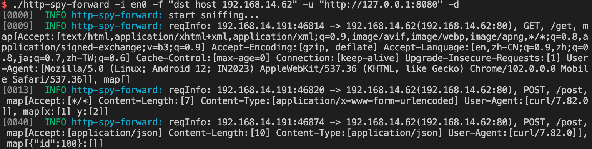
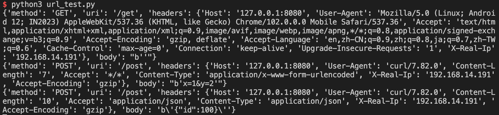

# 工具介绍

一款由golang编写的http包捕获并转发工具，用于将镜像网口中的流量转发到指定URL或蜜罐

# 使用方法

```
$ ./http-spy-forward -h                                                              

A tool for sniff HTTP packets and forward to the target server.

Usage:
  http-spy-forward [flags]

Flags:
  -d, --debug           Debug mode
  -f, --filter string   Filter expression to sniff
  -h, --help            help for http-spy-forward
  -i, --iface string    Network interface to sniff
  -l, --length int32    Length of packet to sniff (default 1024)
  -u, --url string      URL to forward request to
```

使用举例：

首先打开流量接收web服务（模拟URL流量接收器或蜜罐）

```bash
 python3 url_test.py
```

然后启动服务

```bash
./http-spy-forward -i en0 -f "dst host 192.168.14.62" -u "http://127.0.0.1:8080" -d
```

上面这个服务是接收en0网口的流量，并过滤目的host为192.168.14.62的流量，识别其中的http流量，将其中的http请求信息转发至`http://127.0.0.1:8080`，转发的方式为转发请求到`http://127.0.0.1:8080+URI`，并在header中添加`X-Real-Ip:ip.src`




