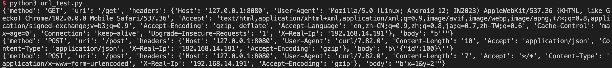
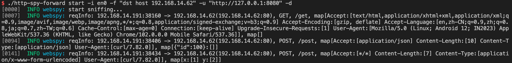

# 工具介绍

一款由golang编写的http包捕获并转发工具，用于将镜像网口中的流量转发到指定URL或蜜罐

# 使用方法

```
$ ./http-spy-forward
NAME:
   http-spy-forward - Packet forward tool, capture HTTP packet and forward request to target URL

USAGE:
   http-spy-forward [global options] command [command options] [arguments...]

VERSION:
   2022/5/13

AUTHOR:
   M1ngkvv1nd

COMMANDS:
   start    sniff local server
   help, h  Shows a list of commands or help for one command

GLOBAL OPTIONS:
   --device value, -i value  device name
   --debug, -d               debug mode
   --filter value, -f value  setting filters
   --length value, -l value  setting snapshot Length (default: 1024)
   --url value, -u value     setting target url
   --help, -h                show help
   --version, -v             print the version
```

使用举例：

首先打开流量接收web服务（模拟URL流量接收器或蜜罐）

```bash
 python3 url_test.py
```

然后启动服务

```bash
./http-spy-forward start -i en0 -f "dst host 192.168.14.62" -u "http://127.0.0.1:8080" -d
```

上面这个服务是接收en0网口的流量，并过滤目的host为192.168.14.62的流量，识别其中的http流量，将其中的http请求信息转发至`http://127.0.0.1:8080`，转发的方式为转发请求到`http://127.0.0.1:8080+URI`，并在header中添加`X-Real-Ip:ip.src`




